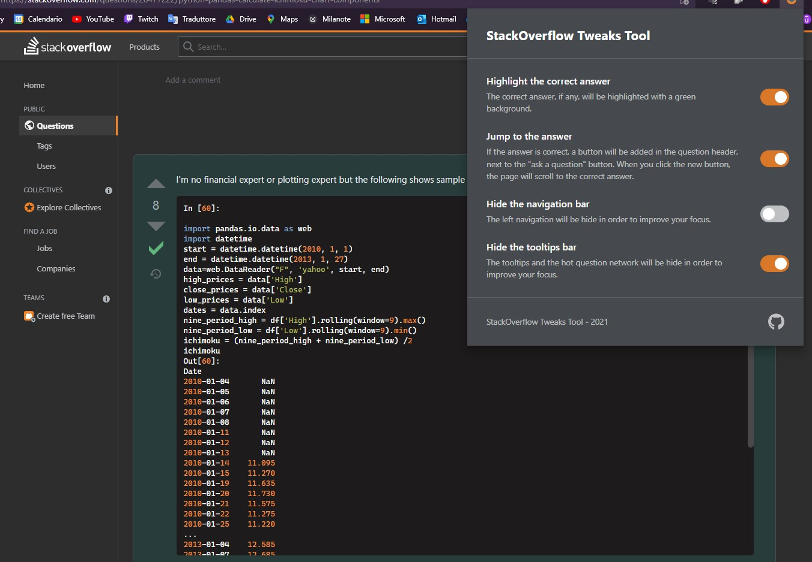

# StackOverflow Tweaks Tool

StackOverflow Tweaks Tool is  a **browser extension** made for developers. The extension provides a small control panel where you can customize the view of the StackOverflow question pages. It works on both Chromium and Firefox.

## Features

### Highlight the correct answer

The correct answer, if any, will be highlighted with a green background.

### Jump to the answer

If the answer is correct, a button will be added in the question header, next to the "ask a question" button. When you click the new button, the page will scroll to the correct answer.

### Improve your focus

Now you can hide the navigation and tooltip bars, so that nothing can distract you.

## Installation

### Firefox

StackOveflow is availbale on the Firefox add-ons [here](https://addons.mozilla.org/it/firefox/addon/stackoverflow-tweaks-tool/). 

### Manual installation

Download the repository. Go to your browser's extensions page, then turn on developer mode and load the src directory by clicking "load unpacked". Visit this [page](https://dev.to/ben/how-to-install-chrome-extensions-manually-from-github-1612) for more information on how to manually install an unpacked extension.

StackOverflow Tweaks Tool will be available on the Chrome Web Store as soon as possible.

> **⚠️** The main branch contains the chromium version of the extension. Switch to the "firefox-version" branch if you want to install it on Firefox.

## License

StackOverflow Tweaks Tool is provided under the MIT license.