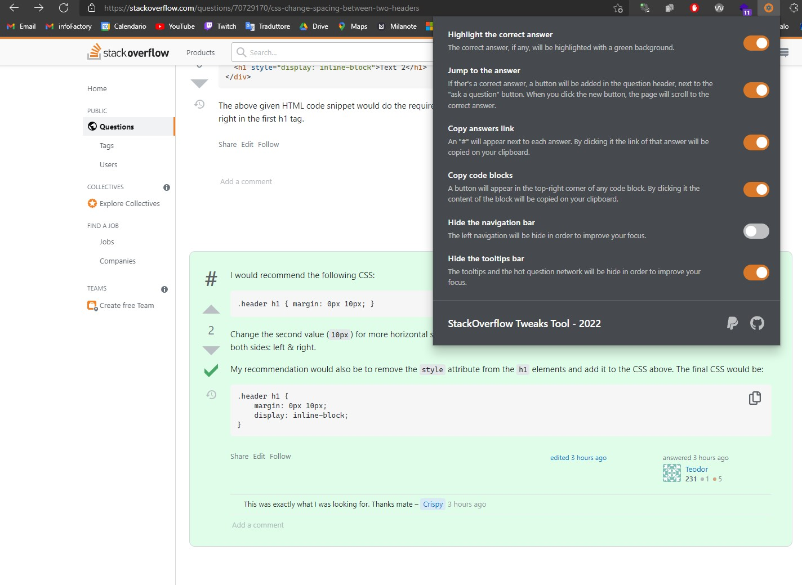

<div align="center" style="text-align: center;">
    
</div>
 
# StackOverflow Tweaks Tool

StackOverflow Tweaks Tool is a **browser extension** made for developers. The extension provides a small control panel where you can customize the view of the StackOverflow question pages. It works on both Chromium and Firefox.



## Features

### Highlight the correct answer

The correct answer, if any, will be highlighted with a green background.

### Jump to the answer

If the answer is correct, a button will be added in the question header, next to the "ask a question" button. When you click the new button, the page will scroll to the correct answer.

### Jump to the most voted

Add a button in the question header. When you click the new button, the page will scroll to the most voted answer.

### Copy answer link

An "#" will appear next to each answer. By clicking it the link of that answer will be copied on your clipboard.

### Copy code blocks

A button will appear in the top-right corner of any code block. By clicking it the content of the block will be copied on your clipboard.

### Improve your focus

Now you can hide the navigation and tooltip bars, so that nothing can distract you.

## Installation

You can find the extension on the [Chrome Web Store](https://chrome.google.com/webstore/detail/stackoverflow-tweaks-tool/dfignoicphdepgloiodeaiokaepjbnan) and on the [Firefox add-ons](https://addons.mozilla.org/firefox/addon/stackoverflow-tweaks-tool/) page.

### Building & manual installation

Clone the repository, then run the following command to install dependencies and make a buid.

```shell
 npm i && npm run build
```

> **⚠️** Run **npm run build firefox** if you want to build the Firefox version.

Now, go to your browser's extensions page, then turn on developer mode and load the src directory by clicking "load unpacked". Visit this [page](https://dev.to/ben/how-to-install-chrome-extensions-manually-from-github-1612) for more information on how to manually install an unpacked extension.

## Acknowledgements

Special thanks to Dorotea Iob for designing the extension logo.

## License

StackOverflow Tweaks Tool is provided under the MIT license.
